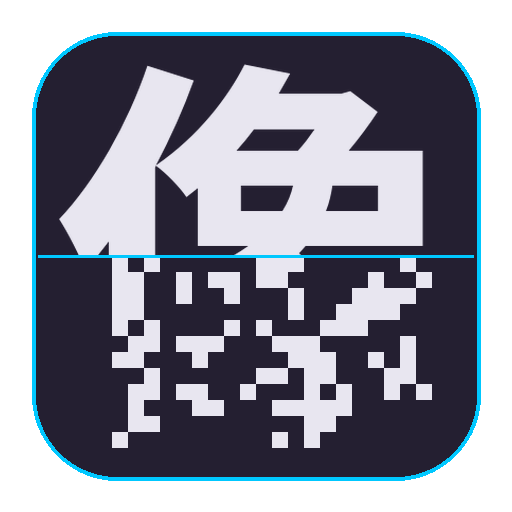

<div align="center">



# ImagEdit

**A GIMP-style desktop app for redacting images — mosaic, blur, or fill any
region, paint with a brush, or let AI detect and redact people and faces.**

[](LICENSE)
[](https://www.python.org/)
[](#install)
[](https://github.com/tqch/ImagEdit/actions/workflows/release.yml)

</div>

---

ImagEdit makes it quick to anonymize photos before sharing them — hide faces,
license plates, screens, or whole people. Everything is **non-destructive**:
each redaction is a layer over the untouched original that you can re-tune or
remove at any time, and nothing leaves your machine.

> **Windows users:** grab the installer from the
> [Releases](https://github.com/tqch/ImagEdit/releases) page — no Python needed.
> See [Downloads](#downloads).

## Features

- **Manual tools** — rectangle, freehand lasso, and a paint **brush**
  (adjustable radius) to redact any region.
- **Three redaction styles**
  - **Mosaic** (pixelate) with adjustable block size.
  - **Gaussian blur** with adjustable strength.
  - **Solid fill** with a full color picker, or **Auto — match surroundings**
    that fills with the region's own mean color so the patch blends in.
- **Privacy-aware feathering** — for fill, the *Edge feather* slider expands the
  patch **outward** (dilation + soft edge) so the redaction blob hides the
  subject's exact contour instead of tracing it. Mosaic/blur keep a symmetric
  soft edge.
- **AI face detection** — bundled OpenCV **YuNet** model finds every face on the
  CPU in milliseconds (no extra downloads). Each face becomes an editable
  subject with an expanded elliptical mask.
- **AI people segmentation** *(optional)* — **YOLOv8** detects people and
  **MobileSAM** produces a precise per-person silhouette. Redact each subject
  individually (or all at once), with colored overlays, ID-tagged boxes, and a
  CPU / Apple-GPU (MPS) / NVIDIA-GPU toggle.
- **Non-destructive layers** — every redaction is a layer. Select one in the
  **Layers** panel and the sliders edit it **live**; toggle visibility or remove
  it with one click. Undo/redo work at the layer level.
- **Watermark / copyright** — overlay a credit line on export: custom text
  (incl. CJK / Unicode), corner/center/tiled position, opacity, size, and color.
- **Quality-of-life** — zoom (Ctrl+wheel), fit-to-window, reset parameters to
  defaults, reset-to-original, startup splash, and a custom app icon you can
  redesign block-by-block with the included icon designer.

## Downloads

Prebuilt **Windows** installers are attached to each
[GitHub Release](https://github.com/tqch/ImagEdit/releases):

| File | What you get |
|------|--------------|
| `ImagEdit-Setup-<version>.exe` | Installer (per-user, no admin). All manual tools + AI **face** detection. |
| `ImagEdit-<version>-windows-portable.zip` | Same app, no installer — unzip and run. |
| `ImagEdit-AI-Extension-<version>-*.zip` | Optional pack that adds AI **people** segmentation (load from the app). |

macOS / Linux: run from source (below).

## Install (from source)

### Conda (recommended)

```bash
git clone https://github.com/tqch/ImagEdit.git
cd ImagEdit
conda env create -f environment.yml
conda activate imagedit
python run.py
```

### pip

```bash
git clone https://github.com/tqch/ImagEdit.git
cd ImagEdit
pip install -r requirements.txt
python run.py
```

The editor needs `PyQt6`, `numpy`, `opencv-python`, and `Pillow`. The AI
**people** feature additionally needs `ultralytics` + `torch` (already in
`requirements.txt` / `environment.yml`); without them the app still runs and
face detection still works — only "Detect people" is disabled. YOLO/SAM weights
(~45 MB) download automatically on first use in a source install.

On Apple Silicon, `imagedit/env.py` sets `PYTORCH_ENABLE_MPS_FALLBACK=1`
automatically so unsupported Metal ops fall back to CPU instead of crashing.

## Usage

1. **File → Open** an image.
2. Pick a **tool** (rectangle / lasso / brush) and a **style**
   (mosaic / blur / fill) in the left panel; adjust the sliders.
3. Draw or paint to add a redaction — it appears as a layer.
4. Select any layer in the **Layers** panel to re-tune it live, hide it, or
   remove it.
5. For people/faces: click **Detect faces** or **Detect people** on the right,
   then **Redact** each subject (or **Redact all**).
6. Optionally enable a **Watermark**.
7. **File → Save As** to export (PNG/JPEG).

## Project layout

```
run.py                         # launcher
imagedit/
  app.py                       # main window, docks, file I/O, AI workflow
  canvas.py                    # layered canvas: tools, zoom, selection, undo
  layers.py                    # RedactionLayer + LayerStack (non-destructive)
  redaction.py                 # mosaic / blur / fill primitives (numpy+OpenCV)
  faces.py                     # YuNet face detection (CPU, bundled model)
  segmentation.py              # YOLO + SAM people segmentation (optional)
  extensions.py                # optional AI extension-pack loader
  watermark.py                 # text watermark / copyright overlay
  env.py                       # runtime env defaults (MPS fallback, etc.)
  assets/                      # icon, splash, bundled YuNet model
tools/
  make_assets.py               # regenerate icon / splash / .ico
  icon_designer/designer.py    # GUI to hand-design the icon's pixelation
packaging/
  imagedit.spec                # PyInstaller (Windows exe)
  installer.iss                # Inno Setup (Windows installer)
  build_extension.py           # build the AI extension pack
.github/workflows/             # release.yml, extension.yml (CI)
```

## Building the Windows installer

Push a version tag and CI builds everything on a Windows runner and attaches it
to the Release:

```bash
git tag v0.1.0
git push origin v0.1.0
```

A single workflow (`release.yml`) runs three jobs: **windows-app** (PyInstaller
exe + Inno Setup installer + portable zip), **ai-extension** (the optional AI
pack), and **release** — the only job that touches the GitHub Release, so the
two builders never race. Use the **Run workflow** button to test without
tagging. To build locally on Windows:

```powershell
pip install PyQt6 numpy opencv-python Pillow pyinstaller
pyinstaller packaging/imagedit.spec --noconfirm
ISCC.exe /DMyAppVersion=0.1.0 packaging\installer.iss   # needs Inno Setup 6
```

### Optional AI extension pack

The lite Windows build omits torch/ultralytics to stay small. To add people
segmentation, the app's AI panel offers **"Enable people detection…"** → load
the pack *From archive* or *From folder*. It is extracted to
`%LocalAppData%/ImagEdit/ai-extension`, its `libs/` is added to the import path,
and the choice is remembered. The pack is **Python/OS-specific** (torch ships
compiled wheels); the app checks its `manifest.json` and warns on a mismatch.
Build it with `python packaging/build_extension.py --version 0.1.0 --cpu`.

## License

ImagEdit is free software under the **GNU General Public License v3.0 or later**
(GPLv3+) — the same copyleft license as GIMP. You may use, study, modify, and
redistribute it (including commercially), provided derivative works stay under
the GPL and ship their source. No warranty. Full text in [`LICENSE`](LICENSE).

GPLv3 is required here because the GUI toolkit **PyQt6** is GPL-licensed.
Per-dependency licenses are in [`THIRD-PARTY-NOTICES.md`](THIRD-PARTY-NOTICES.md).
The optional AI pack adds **Ultralytics YOLO (AGPL-3.0)** — its terms apply only
when that pack is installed, and commercial users may need an Ultralytics
Enterprise license.

Copyright © 2026 **Tianqi Chen**.

## Acknowledgements

Built with [PyQt6](https://riverbankcomputing.com/software/pyqt/),
[OpenCV](https://opencv.org/), [NumPy](https://numpy.org/),
[Pillow](https://python-pillow.org/),
[Ultralytics YOLO](https://github.com/ultralytics/ultralytics),
[MobileSAM](https://github.com/ChaoningZhang/MobileSAM), and
[PyTorch](https://pytorch.org/). Face detection uses the YuNet model from the
[OpenCV Zoo](https://github.com/opencv/opencv_zoo).
